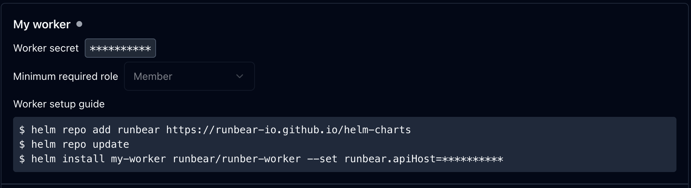

This guide will walk you through the process of installing the Runbear worker agent using a Helm chart. The Runbear worker allows you to execute runbooks within your infrastructure, providing interaction with your internal resources.

## Prerequisites

Before you begin the installation process, ensure that you have the following prerequisites in place:

1. Kubernetes cluster: You should have a Kubernetes cluster up and running to deploy the Runbear worker agent.
2. Helm: Helm should be installed and configured in your Kubernetes cluster. If you haven't installed Helm yet, please refer to the official Helm documentation for instructions: [Helm Documentation](https://helm.sh/docs/intro/install/).

## Installation Steps

Follow these steps to install the Runbear worker agent using the provided Helm chart:

### Step 1: Create a Worker in the Runbear Web App

Navigate to the Runbear [worker settings](https://app.runbear.io/workers) page and create a new worker.



Once the worker is created, note down the worker API secret associated with it. Or you can just grab installation command from the worker settings page.

### Step 2: Configure Helm Repository

Add the Runbear Helm repository to your local Helm configuration by running the following command:

```shell
$ helm repo add runbear https://runbear-io.github.io/helm-charts
$ helm repo update
```

### Step 3: Install the Runbear Worker

Deploy the Runbear worker agent using the Helm chart by running the following command:

```shell
$ helm install runbear-worker runbear/runbear-worker \
 --set runbear.apiSecret=<YOUR_API_SECRET>
```

Replace `<YOUR_API_SECRET>` with the API secret you obtained from the Runbear web app.

Wait for the installation to complete. You can check the status of the deployment by running:

```shell
kubectl get pods
```

Make sure the worker pod is in the "Running" state before proceeding.

Once the worker is online, you can also check the worker status in the Runbear app. You'll note the green dot next to the worker name indicating that the worker is online.

## Customizing RBAC Permissions

Worker creates an ephemeral Kubernetes pod to execute runbooks. The pod is created in the same namespace as the worker.

In order to run some `kubectl` commands, the worker needs to have the appropriate RBAC permissions. By default, `edit` cluster role is assigned to the execution pod. You can customize the RBAC permissions by setting the `runbear.rbac` value in the Helm chart.

For example, to assign `cluster-admin` role to the execution pod, you can add the following to your Helm chart values:

```yaml
runbear:
  executor:
    rbac:
      existingClusterRoleName: cluster-admin
```

Alternatively, you can create a new cluster role with custom rules, and assign it to the execution pod:

```yaml
runbear:
  executor:
    rbac:
      clusterRoleName: my-custom-cluster-role
      clusterRoleRules:
        - apiGroups: [""]
          resources: ["pods"]
          verbs: ["get", "list", "watch", "create", "update", "patch", "delete"]
```

Instead of using a cluster role, you can also assign a role to the execution pod. The role will be created in the same namespace as the worker.

```yaml
runbear:
  executor:
    rbac:
      roleName: my-custom-role
      roleRules:
        - apiGroups: [""]
          resources: ["pods"]
          verbs: ["get", "list", "watch", "create", "update", "patch", "delete"]
```
